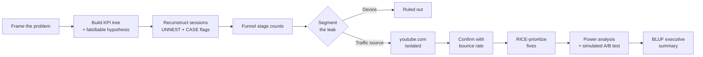

<div align="center">

<a href="https://git.io/typing-svg"></a>

<br/>


📊 **[Narrative summary notebook](notebook/funnel_analysis_summary.ipynb)** · 📄 **[Executive summary](docs/04-executive-summary.md)**

</div>

---

## 📌 TL;DR

- Analyzed session-level funnel data for the Google Merchandise Store (Google Analytics's public GA360 sample dataset).
- Found that **75.7% of sessions never view a single product page** — the largest leak in the funnel, and the *opposite* of the original hypothesis (which assumed checkout was the problem).
- Ruled out device as the cause — desktop, mobile, and tablet convert at a statistically identical ~24%.
- Isolated the actual driver: **youtube.com referral traffic**, driving 87.6% of all referral sessions at a 1.3% product-view rate and an 81.1% bounce rate — 2.5x the site-wide baseline.
- Power-analyzed and simulated an A/B test for the top-ranked fix: a statistically significant **+43.7% relative lift** (p = 0.025).
- Delivered a RICE-prioritized fix list and a BLUF executive summary with recommendation, supporting numbers, and stated limitations.

---

## 🎯 Business Problem

The Google Merchandise Store's overall purchase conversion is low relative to top-of-funnel traffic, and it is unclear which stage of the funnel is responsible for the largest drop-off. **This analysis identifies the highest-leakage funnel stage — segmented by device and traffic source — and recommends the highest-confidence fix to test first.**

Full problem statement and KPI tree: [`docs/01-kpi-tree.md`](docs/01-kpi-tree.md)

---

## 🗂️ Dataset

**[`bigquery-public-data.google_analytics_sample`](https://console.cloud.google.com/marketplace/product/obfuscated-ga360-data/obfuscated-ga360-data)**

Real, anonymized Google Analytics 360 session logs from the Google Merchandise Store, Aug 2016–Aug 2017. Nested schema (sessions contain a repeated `hits` record of individual page/event-level interactions), queried directly in BigQuery via the free Sandbox tier — no billing required.

---

## 🏗️ Methodology



| Step | What was done |
|---|---|
| 1. Framing | PM-style problem statement + 5-stage KPI tree written *before* touching data, with an explicit, falsifiable hypothesis |
| 2. Data access | BigQuery Sandbox (no billing), explored the nested `hits` / `eCommerceAction` schema |
| 3. Funnel SQL | Reconstructed sessions with `UNNEST`, computed stage-by-stage conversion via `CASE` / `MAX` flag aggregation |
| 4. Segmentation | Leading drop-off broken down by device → traffic medium → individual referral domain |
| 5. Root cause | Confirmed with a bounce-rate (single-pageview) comparison against baseline |
| 6. Prioritization | 5 candidate fixes scored with RICE, including an explicit sequencing dependency between two of them |
| 7. Validation design | Power analysis run *before* generating test data; simulated a sample-size-correct A/B test, interpreted via confidence intervals, not just a p-value |
| 8. Communication | BLUF executive summary + this README |

---

## 🔍 Key Findings

### 1. The funnel (Aug 1, 2016 session data)

| Stage | Sessions | Conversion from previous stage |
|---|---|---|
| Total sessions | 1,711 | — |
| Product views | 415 | 24.3% |
| Add to cart | 132 | 31.8% |
| Checkout started | 56 | 42.4% |
| Purchases | 34 | 60.7% |

> The largest leak is Sessions → Product Views, **not** Add-to-Cart → Checkout as originally hypothesized. Checkout → Purchase is in fact the funnel's *strongest*-converting stage.

### 2. Device is not the cause

| Device | Sessions | Product-view rate |
|---|---|---|
| Desktop | 1,412 | 24.4% |
| Mobile | 250 | 24.4% |
| Tablet | 49 | 20.4% (small sample) |

> Rules out the common "mobile UX is worse" assumption — a counter-intuitive, evidence-backed result.

### 3. The real driver: one referral source

| Traffic medium | Sessions | Product-view rate |
|---|---|---|
| Organic | 362 | 34.0% |
| CPC | 25 | 36.0% |
| **Referral** | **435** | **3.4%** |

Within referral, **youtube.com** alone accounts for 381 of 435 sessions (87.6%) at a 1.3% product-view rate and an **81.1% single-pageview bounce rate** — 2.5x the 32.0% site-wide baseline. Every other referral source converts normally or better.

> Two open, unconfirmed hypotheses: landing-page mismatch, or automated/bot traffic. This dataset cannot distinguish between them without user-agent or session-duration data — stated explicitly as a limitation, not papered over.

### 4. Simulated A/B test result

Powered for a baseline-to-target lift of 1.3% → 2.0% (α = 0.05, power = 0.80, ~4,049 sessions/arm, ~21-day minimum real-world runtime).

| | Control | Treatment |
|---|---|---|
| Sessions | 4,049 | 4,049 |
| Product-view rate | 1.19% | 1.70% |
| 95% CI | 0.90%–1.57% | 1.35%–2.15% |

**+43.7% relative lift, p = 0.025 (one-sided) — statistically significant**, though confidence intervals overlap slightly. Reported as directionally promising, not conclusively proven, pending a live confirmation test.

---

## ✅ Recommendation

**Ship a contextual welcome banner for youtube.com-referred sessions, with bot-traffic filtering as a prerequisite step** — so the live test isn't measuring against noisy, partially non-human traffic.

Full RICE scoring and fix alternatives: [`docs/02-rice-prioritization.md`](docs/02-rice-prioritization.md)

---

## ⚠️ Limitations

- All funnel and segmentation findings are based on a single day of data (Aug 1, 2016) and have not yet been validated across a wider date range.
- The youtube.com root cause has two plausible, unconfirmed explanations that this dataset cannot distinguish between.
- The A/B test is simulated, not observed; the real test requires ~21 days at current traffic volume, and a novelty effect could inflate an initial live result.
- Organic traffic converts at only 34%, suggesting a second, smaller, unaddressed leak outside this analysis's scope.

Full caveats and stakeholder-facing summary: [`docs/04-executive-summary.md`](docs/04-executive-summary.md)

---

## 🛠️ Tech Stack

- **Querying**: Google BigQuery (Sandbox, no billing) — `UNNEST`, `CASE`/`MAX` flag aggregation, window-style session reconstruction
- **Statistical testing**: Python, `statsmodels` (power analysis, two-proportion z-test, Wilson confidence intervals)
- **Analysis & visualization**: `pandas`, `matplotlib`, Jupyter
- **Version control**: Git / GitHub

---

## 📁 Project Structure

```
funnel-analysis-portfolio/
├── README.md
├── docs/
│   ├── 01-kpi-tree.md              # problem statement, KPI tree, hypothesis, first result
│   ├── 02-rice-prioritization.md   # fix list, RICE scoring, recommendation
│   ├── 03-ab-test-results.md       # power analysis, simulated test, interpretation
│   └── 04-executive-summary.md     # BLUF summary for stakeholders
├── sql/
│   ├── 01_session_flag_test.sql
│   ├── 02_all_funnel_flags.sql
│   ├── 03_funnel_stage_counts.sql
│   ├── 04_device_segmentation.sql
│   ├── 05_traffic_medium_segmentation.sql
│   ├── 06_referral_domain_breakdown.sql
│   └── 07_bounce_rate_by_source.sql
├── analysis/
│   ├── ab_test_simulation.py
│   └── ab_test_simulated_sessions.csv
└── notebook/
    └── funnel_analysis_summary.ipynb   # narrative walkthrough with charts
```

---

## 🚀 How to Reproduce

```bash
git clone https://github.com/tarunmaurya13/funnel-analysis-portfolio.git
cd funnel-analysis-portfolio
```

1. Open [BigQuery](https://console.cloud.google.com/bigquery) — no billing required (Sandbox mode).
2. Run the queries in `sql/` in order against `bigquery-public-data.google_analytics_sample.ga_sessions_20160801` (or any date in the dataset).
3. Reproduce the A/B test simulation:
   ```bash
   pip install statsmodels pandas numpy
   python analysis/ab_test_simulation.py
   ```
4. Open `notebook/funnel_analysis_summary.ipynb` for a visual walkthrough of all findings.

---

## 📈 Future Improvements

- Extend the funnel and segmentation queries across the full Aug 2016–Aug 2017 date range to confirm the youtube.com pattern is stable, not a single-day anomaly
- Add `user_agent` / bot-classification logic to distinguish landing-page mismatch from automated traffic
- Run the A/B test live and follow up with a 4–6 week confirmation test to rule out novelty effect
- Investigate the secondary, unaddressed leak in organic traffic (34% product-view rate)

---

<div align="center">

## 👤 Author

**Tarun Maurya**
Final-year BCA (AI), Invertis University
[GitHub](https://github.com/tarunmaurya13)

</div>
